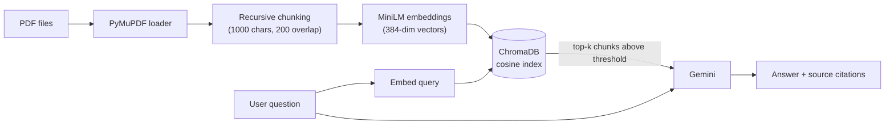

# PDF Question Answering System using RAG

Ask questions about your own PDF documents and get answers grounded in the text, with the **source file and page cited for every answer**. Built step by step without a RAG framework, so every stage of the pipeline (loading, chunking, embedding, retrieval, generation) is explicit and easy to follow.


## Features

- **Upload and query your own PDFs** through a Streamlit chat interface
- **Grounded answers with citations**: every response lists the source file, page number, and similarity score of the chunks it used
- **Refuses out-of-scope questions**: if nothing relevant is retrieved, the app says so instead of letting the LLM guess
- **Persistent index**: embeddings are stored on disk in ChromaDB, so documents are indexed once and reused across sessions
- **Adjustable retrieval**: sliders in the UI control how many chunks are retrieved (top-k) and the minimum similarity
- **Resilient LLM calls**: automatic retry with exponential backoff when the Gemini API is overloaded

## How It Works



**Indexing (once per document set)**

1. **Load**: PyMuPDF reads each PDF page by page.
2. **Chunk**: `RecursiveCharacterTextSplitter` splits pages into ~1000-character chunks with 200 characters of overlap, so explanations are not cut in half at chunk boundaries.
3. **Embed**: `all-MiniLM-L6-v2` converts each chunk into a 384-dimensional vector.
4. **Store**: vectors, text, and metadata (file, page) are saved in a persistent ChromaDB collection using cosine distance.

**Answering (every question)**

1. **Embed** the question with the same model.
2. **Retrieve** the top-k most similar chunks, dropping any below the similarity threshold.
3. **Generate**: the surviving chunks are placed in a prompt, and Gemini answers using only that context.
4. **Cite**: the answer is returned along with the file, page, and score of each source chunk.

## Tech Stack

| Component | Technology |
|---|---|
| Language | Python |
| PDF parsing | PyMuPDF |
| Text splitting | LangChain Text Splitters |
| Embeddings | Sentence-Transformers (`all-MiniLM-L6-v2`) |
| Vector database | ChromaDB (persistent, cosine similarity) |
| LLM | Google Gemini (via the `google-genai` SDK) |
| Interface | Streamlit |
| Config | python-dotenv |

## Project Structure

```
.
├── app.py                 # Streamlit chat interface
├── src/
│   ├── config.py          # All settings in one place
│   ├── embeddings.py      # SentenceTransformer wrapper
│   ├── vectorstore.py     # ChromaDB store (cosine distance, idempotent upserts)
│   ├── retriever.py       # Query -> top-k chunks with similarity scores
│   ├── generator.py       # Prompt building + Gemini call with retry
│   ├── ingest.py          # Load, split, embed, store
│   └── pipeline.py        # RAGPipeline: ties all the pieces together
├── notebooks/             # Early experiments and step-by-step development
├── data/
│   └── pdf/               # Put your PDFs here (not tracked by git)
├── docs/                  # Screenshots
├── requirements.txt
├── .env.example
└── README.md
```

## Getting Started

### Prerequisites

- Python 3.10 or newer (developed on 3.12)
- A free Gemini API key from [Google AI Studio](https://aistudio.google.com/apikey)

### Installation

```bash
git clone https://github.com/shreyalakhmani-06/PDF-QA-System-RAG-
cd PDF-QA-System-RAG-
```

Create and activate a virtual environment, then install the dependencies:

```bash
# macOS / Linux
python -m venv .venv
source .venv/bin/activate

# Windows (PowerShell)
python -m venv .venv
.\.venv\Scripts\Activate.ps1

pip install -r requirements.txt
```

> The first install is large because `sentence-transformers` pulls in PyTorch. The embedding model (~90 MB) is downloaded automatically on first run.

### Set your API key

Copy the example file and add your key:

```bash
cp .env.example .env        # Windows: copy .env.example .env
```

```env
GEMINI_API_KEY=your_key_here
GEMINI_MODEL=gemini-3.8-flash
```

Never commit `.env`. It is already listed in `.gitignore`.

### Run the app

```bash
streamlit run app.py
```

Then open <http://localhost:8501>.

## Usage

1. In the sidebar, **upload one or more PDFs** and click **Index documents**. The sidebar shows how many chunks are in the index.
2. **Ask a question** in the chat box.
3. Read the answer and **expand the source boxes** to see the exact passages, page numbers, and similarity scores used.
4. Tune retrieval with the sliders if needed:
   - **top-k**: how many chunks are sent to the LLM
   - **Min similarity**: chunks scoring below this are discarded

Clicking **Index documents** rebuilds the index from every PDF in `data/pdf/`. You can also copy PDFs into that folder yourself before clicking it.

> PDFs must contain selectable text. Scanned, image-only PDFs produce no chunks because OCR is not included.

## Configuration

Defaults live in `src/config.py`.

| Setting | Default | Description |
|---|---|---|
| `EMBEDDING_MODEL` | `all-MiniLM-L6-v2` | Sentence-Transformers model used for chunks and queries |
| `CHUNK_SIZE` | `1000` | Characters per chunk |
| `CHUNK_OVERLAP` | `200` | Characters shared between neighbouring chunks |
| `TOP_K` | `5` | Chunks retrieved per question |
| `SCORE_THRESHOLD` | `0.25` | Minimum cosine similarity for a chunk to be used |
| `GEMINI_MODEL` | `gemini-3.8-flash` | Overridable via `.env` |

After changing `CHUNK_SIZE`, `CHUNK_OVERLAP`, or the embedding model, re-index your documents so the stored vectors match the new settings.

## Design Decisions

- **Cosine distance, set explicitly.** ChromaDB defaults to L2 distance, which made `1 - distance` an incorrect similarity score. I noticed this while inspecting retrieval scores and created the collection with `{"hnsw:space": "cosine"}`, so scores are meaningful and can be thresholded.
- **Similarity threshold of 0.25.** In testing, a specific in-scope question scored roughly 0.45 to 0.65, while an unrelated one stayed below 0.2. A threshold in that gap lets the app refuse off-topic questions without spending an LLM call.
- **Grounded prompting.** The system prompt tells the model to answer only from the supplied context and to say when the answer is not there.
- **Retry with exponential backoff.** Gemini occasionally returns 503 overload errors, so calls are retried a few times with increasing waits before failing.
- **Idempotent indexing.** Chunk IDs are derived from content and location, and writes use `upsert`, so re-running ingestion does not create duplicates.
- **Metadata cleaning.** Some PDFs carry `None` metadata values, which ChromaDB rejects, so metadata is sanitised before storing.
- **Modular `src/` package.** Each stage is its own module with a single responsibility, which keeps the notebooks, the UI, and any future scripts on the same code.

## Troubleshooting

| Problem | Fix |
|---|---|
| `GEMINI_API_KEY is not set` | Create `.env` in the project root (not inside `src/`) and restart the app |
| `404 NOT_FOUND ... model is no longer available` | Google retired the model name. Set `GEMINI_MODEL` in `.env` to a current Gemini Flash model and restart |
| `503` or "Gemini busy" messages | Temporary API overload. The app retries automatically; if it still fails, try again in a minute |
| "I couldn't find anything relevant" for a question the PDF covers | Lower **Min similarity** in the sidebar, or rephrase using words closer to the document |
| Chunk count is 0 after indexing | The PDF has no extractable text (likely a scan) |
| `ModuleNotFoundError: No module named 'src'` | Run commands from the project root |
| Changes in `src/` or `.env` have no effect | Fully restart Streamlit (`Ctrl + C`, then run it again); it caches the pipeline |

## Limitations and Future Work

- **No OCR**: scanned PDFs are not supported.
- **Full re-index on every click**: adding one file re-embeds all files. Incremental indexing would make this faster for large libraries.
- **No quantitative evaluation yet**: retrieval quality has been checked by hand, not against a labelled question set. A planned improvement is a test set with hit rate @k and MRR, plus a comparison of chunk sizes.
- **Single-turn Q&A**: the app does not use earlier messages as context.
- **Ideas for next steps**: hybrid BM25 + vector search, a cross-encoder re-ranker, conversation memory, and support for DOCX and web pages.

## Author

**Shreya Lakhmani**
